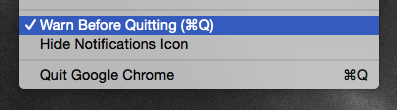
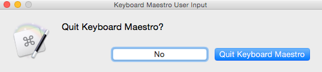
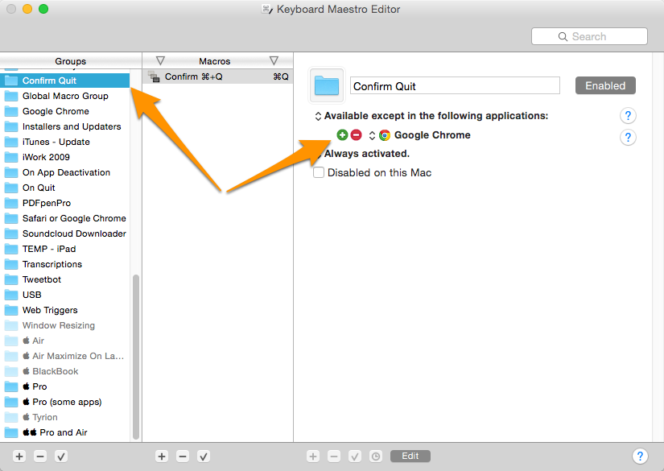
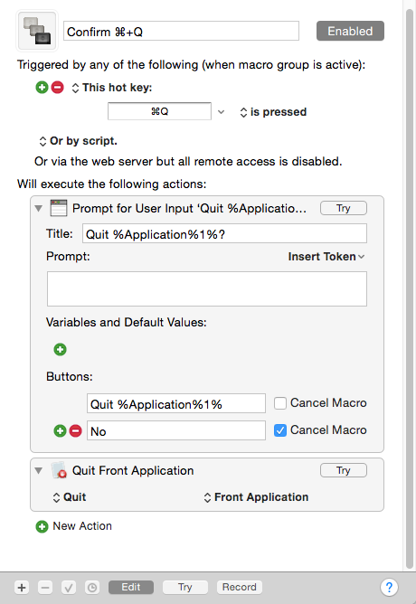
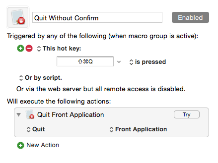

# km-confirm-quit

Use [Keyboard Maestro][] to confirm ⌘+Q before quitting (almost) any Mac OS X app.

## Background ##

My friend [Guillermo Esteves](https://twitter.com/gesteves) had [a good idea](https://twitter.com/gesteves/status/532187436596867073):

<blockquote class="twitter-tweet" lang="en">
Chrome’s “warn before quitting” setting should really be a system-wide OS X setting. <a href="http://t.co/e9sTiEOSBq">pic.twitter.com/e9sTiEOSBq</a>
&mdash; Guillermo Esteves (@gesteves) <a href="https://twitter.com/gesteves/status/532187436596867073">November 11, 2014</a></blockquote> 

I knew this would be simple to do in [Keyboard Maestro][] but even I was surprised how easy it was:

1. Create Keyboard Maestro macro to respond to ⌘+Q
	* If user confirms, tell Keyboard Maestro to quit front-most app.
	* If user does not confirm, cancel the macro.

2. (Optional) Create a new “group” for this macro so that the user can dictate which apps will (or will not) use the macro. For example, since Google Chrome already has an option for this, you might want to exclude Google Chrome from this macro. Or maybe you want to specify which apps you want to confirm and have all of the others just quit as usual.

## There are a few provisos, a couple of *quid pro quos*… ##

*	If you press ⌘+ Tab and then ⌘+Q, the app in the app switcher _will quit without confirmation_.
*	The confirmation may not work as expected if the active app does not have a Dock icon. Always be sure to look at the name of the app in the prompt. _(If you find an app that doesn’t work as expected, let me know.)_
*	If you select the “Quit” menu item using your mouse, you will not be asked for confirmation. (This seemed obvious, but I figured I should mention it anyway.)

## Download and Install ##

1.	Download the [Confirm-Quit.kmmacros.zip](Confirm-Quit.kmmacros.zip) file and unzip it. (Double clicking it should do it.)

2.	Double-click the **Confirm-Quit.kmmacros** file to import the macro into Keyboard Maestro.

3.	There is no step three.

## Keyboard Shortcuts for the Confirm Quit prompt

Obviously you could click the button that you want, but it’s probably easiest to use the keyboard shortcuts:

*  Press Enterto quit the named app
*  Press Esc(or Space)  for No

## Edit the Group (Optional)

By default the Keyboard Maestro group “Confirm Quit” is set up to be active in every application except ones which you specify. To add apps, click the red + and to remove, click the red -. For example, iTerm also has its own confirmation preference. If you use that, you should add iTerm to the list.

If you want to change the group definition to specify _which_ apps will have their quit confirmed, click where it says “Available except in the following applications” and select “Available in the following applications” instead.

[Keyboard Maestro]: http://www.keyboardmaestro.com/main/

## Edit the Macro (Optional) ##

This is what the Keyboard Maestro macro looks like, as I have it. `%Application%1%` is a Keyboard Maestro variable for “Front Application Name.”

## “But What if Sometimes I _Don’t_ Want to Confirm Quitting Apps?” ##

If you download [Confirm-Quit-and-Bypass-Quit.kmmacros.zip](Confirm-Quit-and-Bypass-Quit.kmmacros.zip) _instead_ of the .zip above, it will install _two_ macros. One will confirm ⌘+Q as above, but a _second_ macro will quit the front-most application if you press  ⌘+⇧+Q.

Note that this might not work if the app does not have an icon in the Dock. Use at your own risk.